# 图

## 零、基本概念

**图的概念**：

顶点（Vertex），边（Edges），度（degree）: 入度和出度indegree，outdegree

有向无环图：DAG

握手定理（无向图）：一个聚会上，把每个人握手的次数相加必为偶数，也就是所有顶点的度加起来等于边数的两倍。

**图的分类**

- 有向图（Directed Graph）：单箭头，顶点A，B：  (A,B) != (B,A)

- 无向图（Un-Directed Graph）：双箭头，顶点A，B：  (A,B) = (B,A)

**图的表示：**

图可以用邻接矩阵或者邻接链表表示。邻接矩阵适用于稠密图的情况，邻接链表适用于稀疏图的情况。

- 邻接矩阵(adjacency matrix)：

  ​	图有V个顶点，则设置 V x V 0-1矩阵，若矩阵元素A[i,j]=1，则有边连接Vi，Vj

  ​	在无向图中，矩阵对称。若将0，1设为边的权重，则为加权图。

  优点：插入、删除、查找边 O（1），缺点：占用空间，增加顶点O（V^2）

  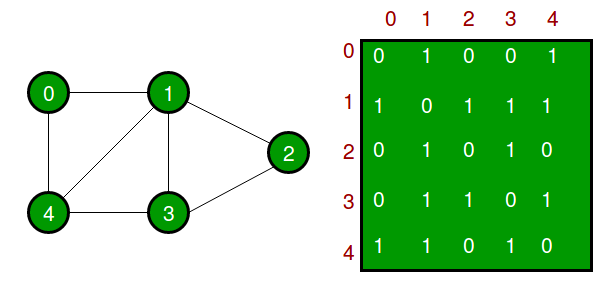

- 邻接列表(adjacency list)

  链表组成的数组，数组大小等于顶点数。链表记录一个顶点的所有邻接点。

  优点：占用空间等于O（V+E），增加顶点容易。缺点：查询边O（V）

  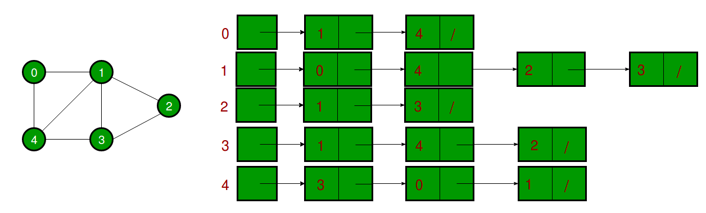


## 一、图的遍历


### 1.1 广度优先搜索(BFS)

Breadth First Search：思路：Traverse nodes in layers，类似树的层序遍历。

问题在于，若图循环，按层遍历会多次访问同一结点。解决之道：用bool标记。

调用的结构：queue，一个结点出去，其所有还未入队过的相邻结点入队。

注意：如果图不是连通的！那么！ 要对所有结点进行一次是否被访问的检测。

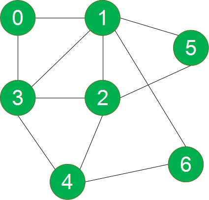

**例上图：**0为起点；0出，13入；1出，256入；3出，4入；2出；5出；6出；4出。如果上图另外还有一个7-8，非连通，则从7开始进行第二轮BFS。

### 1.2 深度优先搜索(DFS)

Depth First Search：思路：类似树的先序遍历。从某个顶点出发，只要有选择，就不断往前走，要是没路了，就退回，直到栈为空。对访问过的节点用bool标记。

注意：如果图不是连通的！那么！要对所有结点进行一次是否被访问的检测。

调用结构：stack，用栈记录走过的路，便于退回。

**例上图：**1为起点；访问3，1入栈；访问4，3入栈；访问6，4入栈；6无路退回，4出栈；访问2，4入栈；访问5，2入栈；5无路退回，2出栈；2无路，4出栈；4无路退回，3出栈，访问0，3入栈；0无路退回，3出栈；3出栈，3无路，1出栈，1无路，结束。如果上图另外还有一个7-8，非连通，则从7开始进行第二轮BFS。

##### DFS中不同边的分类

边的分类是在对图进行DFS才有的概念，同一张图中，DFS的方式不同，产生的边的类型也不一样。在普通的DFS中，用来记录结点是否被访问只需要用到2个值，也就是bool visited[V]。

在扩展应用中，被访问过的结点会有3个值：char visited[V]

-  -1：表示结点未被访问
- 0：表示结点被访问，但后代没被访问完，也就是还在栈中，还在这条路上没返回
- 1：表示结点被访问完，后代也被访问完，已经从这条路上返回了

边的分类：DFS中，对于一条边 u -> v 

- forward edges : visited[v]=1，从祖先指向其子辈的边。
- back edges：visited[v]=0，v已经被访问完，还在这条路上，v->u->v，成环！
- cross edges：visited[v]=1, v已经被访问，后代也被访问，uv没有祖孙关系，是兄弟或者更远甚至不在一棵树上
- tree edges： visited[v]=-1，v是首次被发现。DFS森林实际组成部分。

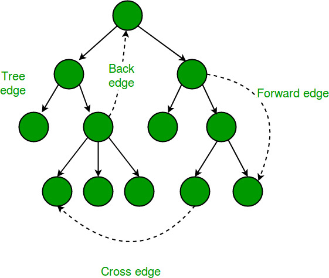

### 1.3 复杂度考虑

每个节点仅遍历一次，因此时间复杂度至少为**O（V）**。

除此之外，任何其他的复杂性都来自于如何发现每个节点的所有传出路径或边，而这些又依赖于实现图形的方式。典型的DFS实现使用哈希表维护遍历的节点列表，以便您可以确定在O（1）时间（恒定时间）之前是否遇到过节点。

- 如果将图形实现为邻接矩阵（V x V数组），则对于每个节点，必须遍历矩阵中长度为V的整行以发现其所有出站边。请注意，邻接矩阵中的每一行都对应图中的一个节点，并且该行存储有关源自该节点的边的信息。因此，复杂度为**O（V \* V）= O（V ^ 2）**。

- 如果图是使用邻接表实现的，其中每个节点都维护着其所有相邻边的列表，那么对于每个节点，可以通过在线性时间内仅遍历其邻接表来发现其所有邻居。对于有向图，所有节点的邻接表大小的总和为E（边的总数）。因此，DFS的复杂度为**O（V）+ O（E）= O（V + E）**。

- - 对于无向图，每个边将出现两次。一旦在边缘任一端的邻接表中。因此，总体复杂度将为**O（V）+ O（2E）〜O（V + E）**。

- 还有其他实现图的方法。可以据此推断复杂性。

### 1.4 代码实现
##### Code : BFS&DFS

```cpp
#pragma once
#include <iostream>
#include <list>
#include <queue>
#include <stack>
#include <vector>
using namespace std;
class AdjlistGraph
{
	int V;
	vector<list<int>> adj;
public:
	AdjlistGraph(int _V) :V(_V) {
		for (int i = 0; i < _V; i++)
		{
			list<int> ls;
			ls.push_back(i);
			adj.push_back(ls);
		}
	}
	void addEdge(int a, int b);
	void BFS();
	void DFS();
	void BFS(int start, vector<bool> &visited);
	void DFS(int start,vector<bool> &visited);
};

void AdjlistGraph::addEdge(int a, int b) {
	adj[a].push_back(b);
	adj[b].push_back(a);
}
// BFS遍历
void AdjlistGraph::BFS() {
	vector<bool> visited(V, false);
	for (int i = 0; i < V; i++)
	{
		if (visited[i] != true) { 
			BFS(i, visited); cout << endl;
		}
	}
}
// 对图的一个极大连通区域进行遍历
void AdjlistGraph::BFS(int start, vector<bool> &visited) {
	queue<int> q;
	q.push(start);
	visited[start] = true;
	while (!q.empty())
	{
		int k = q.front();
		q.pop();
		cout << k << " ";
		for (auto i = adj[k].begin(); i!=adj[k].end(); i++){
			if (!visited[(*i)]) {
				q.push(*i);
				visited[(*i)] = true;
			}
		}
	}
}

// DFS遍历
void AdjlistGraph::DFS() {
	vector<bool> visited(V, false);
	for (int i = 0; i < V; i++)
	{
		if (visited[i] != true) {
			DFS(i, visited); cout << endl;
		}
	}
}
// 对图的一个极大连通区域进行遍历
void AdjlistGraph::DFS(int start,vector<bool> &visited) {
	stack<int> s;
	s.push(start);
	cout << start << " ";
	visited[start] = true;
	while (!s.empty())
	{
		int v = s.top();
		auto i = adj[v].begin();
		bool flag = false;
		for (; i != adj[v].end(); i++){ 
			// 去找链表中的未访问结点，找到就退出
			if (!visited[(*i)])
			{
				flag = true;
				break;
			}
		}
		if (flag == true)
		{
			s.push(*i);
			cout << (*i) << " ";
			visited[(*i)] = true;
		}
		else s.pop();
	}
}
```

##### Test : main.cpp

```cpp
#include "AdjlistGraph.h"
int main(int argc, char ** argv) {
	AdjlistGraph g(7);
	g.addEdge(0, 1);
	g.addEdge(0, 3);
	g.addEdge(3, 1);
	g.addEdge(3, 4);
	g.addEdge(2, 5);
	g.addEdge(1, 5);
	g.addEdge(1, 6);
	g.addEdge(4, 6);
	g.addEdge(2, 4);
	g.addEdge(7, 8);
	g.BFS();
	cout <<endl << "************" << endl;
	g.DFS();
	cout <<endl<<  "************" << endl;

	system("pause");
	return 0;
}
```


### 1.5 应用：环检测、拓扑排序、寻找强连通分量

**self-loop：**一个结点指向自己，自己成环

**parallel edges：** 两个相邻结点之间存在多条路径

#### 1.5.1 无向图环检测

#####  BFS无向图环检测

BFS中有一个queue，用一个数组表示所有结点的状态，-1表示未遇到，0表示遇到了，入了queue但没访问，1表示遇到了，出了queue并访问了。当进行BFS遍历的时候，需要将当前节点的邻接点都放入queue中，若这些邻接点中存在0，则说明有环存在。

##### DFS无向图环检测

通过DFS，判断当前节点v，若有一v的相邻顶点u已被访问，且u不是v的父，则有环。解释：DFS是沿着路径走，对于无向图，可以直接访问其父，但是其他祖宗无环的话就无法访问了。需要结构：visited数组（二元即可）; 一变量：记录父节点，若是需要记录哪里成环，用数组记录pair(vertex,parent)即可。

###### Code：iscyclicDSFinUndirected

```c++
// DFS检查无向图一个极大连通区域的环，有环返回真
bool AdjlistGraph::iscyclicDSF() {
	vector<bool> visited(V, false);
	for (int i = 0; i < V; i++)
	{
		if (visited[i] != true) {
			if (iscyclicDSF(i, visited)) return true;
		}
	}
	return false;
}

// 对无向图的一个极大连通区域进行遍历
bool AdjlistGraph::iscyclicDSF(int start,vector<bool> &visited) {
	vector<int> s; // 因为需要遍历栈中的元素，所以用vector来代替栈的使用
	vector<int> parent(V,-1);// 令头结点的父元素等于-1
	s.push_back(start);
	visited[start] = true;
	while (!s.empty()) // 此处也被修改
	{
		int v = s.back();
		bool flag = false;
		for (auto i = ++adj[v].begin(); i != adj[v].end(); i++)
		{	// 加个for循环来遍历邻接节点，看是否已被遍历且非当前节点的父节点
			if (visited[(*i)] && parent[v]!=(*i) && parent[(*i)]!=v) {
				cout << (*i) << endl;
				return true;
			}
		}
		auto i = ++adj[v].begin();
		for (; i != adj[v].end(); i++){ 
			if (!visited[(*i)]) { 
				flag = true;
				break;
			}
		}
		if (flag == true){
			s.push_back(*i);
			visited[(*i)] = true;
			parent[(*i)] = v;
		}else s.pop_back();
	}
	return false;
}
```

###### Test：iscyclicDSFinUndirected

```cpp
#include "AdjlistGraph.h"
int main(int argc, char ** argv) {
	AdjlistGraph g(8);
	g.addEdge(0, 1);
	g.addEdge(1, 2);
	g.addEdge(3, 2);
	g.addEdge(5,1);
	g.addEdge(5, 4);
	g.addEdge(2, 4);

	bool  res  = g.iscyclicDSF();
	if (res) {
		cout <<  "there is a cycle in the graph" << endl;
	}
	else {
		cout << "there is no cycle in the graph" << endl;
	}

	system("pause");
	return 0;
}
```


#### 1.5.2 有向图环检测

用有向图完成优先级问题，若有环，必无解。

##### DFS有向图环检测

通过DFS，来判断当前节点v是否连接Stack中的祖先节点。若点v连接祖先节点w，则成环。对于非联通的图，多套一层函数对子图做一次好啦，和DFS的处理是一样的。

解释：根据DFS，当前的路径是从w->v，若v有边指向祖先节点，则v->w,成环

具体实现：在DFS内部加了一层for循环遍历stack判断祖先。

测试用图：

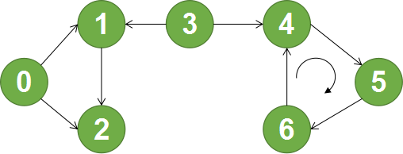

###### Code : iscyclicDSFinDirectedGraph

```cpp
#pragma once
#include <iostream>
#include <algorithm>
#include <list>
#include <vector>
using namespace std;
class AdjlistGraph
{
	int V;
	vector<list<int>> adj;
public:
	AdjlistGraph(int _V) :V(_V) {
		for (int i = 0; i < _V; i++)
		{
			list<int> ls;
			ls.push_back(i);
			adj.push_back(ls);
		}
	}
	void addEdge(int a, int b);
	
	bool iscyclicDSF();
	bool iscyclicDSF(int start,vector<bool> &visited);
};

void AdjlistGraph::addEdge(int a, int b) {
	adj[a].push_back(b);
}


// DFS检查有向图一个极大连通区域的环，有环返回真
bool AdjlistGraph::iscyclicDSF() {
	vector<bool> visited(V, false);
	for (int i = 0; i < V; i++)
	{
		if (visited[i] != true) {
			if (iscyclicDSF(i, visited)) return true;
		}
	}
	return false;
}

// 对有向图的一个极大连通区域进行遍历
bool AdjlistGraph::iscyclicDSF(int start,vector<bool> &visited) {
	vector<int> s; // 因为需要遍历栈中的元素，所以用vector来代替栈的使用
	s.push_back(start);
	visited[start] = true;
	while (!s.empty())
	{
		int v = s.back();
		bool flag = false;
		for (auto i = ++adj[v].begin(); i != adj[v].end(); i++)
		{	// 判断其邻接点是否在栈中，是则有环,返回退出
			// 其实邻接表是顺序访问的，这个循环可以和下面的循环放在一起，
			//  但是为了思路好看，就提出来了
			if (std::find(s.begin(), s.end(), *i) != s.end()) {
				cout << (*i) << endl;
				return true;
			}
		}
		auto i = ++adj[v].begin();
		for (; i != adj[v].end(); i++){ 
			if (!visited[(*i)]) { // 去找链表中的未访问结点，有就压入栈中
				flag = true;
				break;
			}
		}
		if (flag == true){
			s.push_back(*i);
			visited[(*i)] = true;
		}
		else s.pop_back();
	}
	return false;
}
```

###### Test : iscyclicDSFinDirectedGraph

```cpp
#include "AdjlistGraph.h"
int main(int argc, char ** argv) {
	AdjlistGraph g(7);
	g.addEdge(0, 1);
	g.addEdge(0, 2);
	g.addEdge(1, 2);
	g.addEdge(3, 1);
	g.addEdge(3, 4);
	g.addEdge(4, 5);
	g.addEdge(5, 6);
	g.addEdge(6, 4);

	bool  res  = g.iscyclicDSF();
	if (res) {
		cout <<  "there is a cycle in the graph" << endl;
	}
	else {
		cout << "there is no cycle in the graph" << endl;
	}

	system("pause");
	return 0;
}
```

## 二、并查集UnionFind/Disjoint-set

Union-Find algorithm：Union-Find用于处理一些不交集的合并及查询问题。可以用于解决许多经典的划分问题，比如门派分类，城际连通，网络连接等。

### 2.1 实现原理

两步主要操作：

**Find**：找到当前元素的root，也就是确定元素属于哪一个子集。元素进行一次查找后就将其祖先元素设为根结点（路径压缩以优化查找速度）。

**Union**：将两个子集合并成一个子集。合并时，高树吸收矮树（根据高度合并以优化查找速度）。

Find和Union中的两步优化，确定两个元素是否属于同一子集的算法平摊时间是O（1），而不是O（n）。

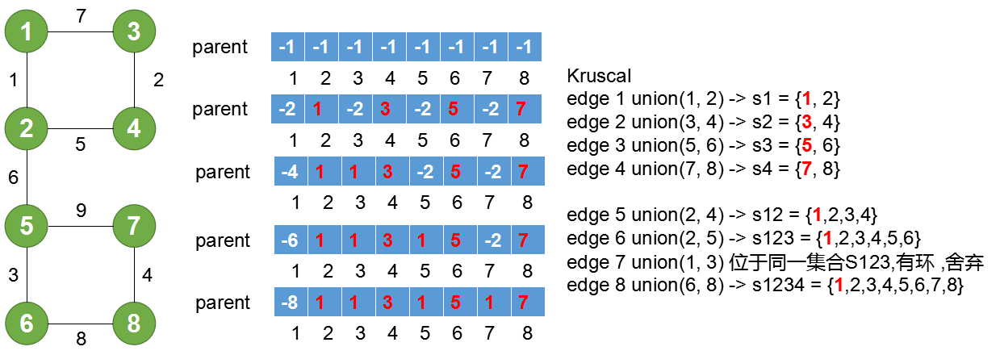

### 2.1 代码实现

###### Code:DisjointSet

此处并查集设置了两个数组，一个数组用来记录结点的父节点，另一个数组用来记录树的高度；可以简化，parent数组初始化为-1而不是自身，每次merge之后，都改变根结点的高度，用负数的大小来记录树的高度，其他的父节点任然用正常父节点表示。

```cpp
#pragma once
class DisjointSet {
public:
	int V;
	int *parent; // parent[i]是i结点的父节点
	int *rank;   // rank[i]是树高

    DisjointSet(int v) :V(v) {
		rank = new int[V];
		parent = new int[V];
		for (int i = 0; i < V; i++)
			parent[i] = i;
	}
	int find(int i);          // 查找到i的root
	void merge(int i, int j); // 合并俩集合
};

int DisjointSet::find(int i) {
	if (parent[i] == i) return i;
	else {
		parent[i] = find(parent[i]);
		return parent[i];
	}
}

void DisjointSet::merge(int i, int j) {
	int iset = find(i);
	int jset = find(j);
	if (iset == jset) return;

	int irank = rank[iset];
	int jrank = rank[jset];
	if (irank == jrank) {
		parent[iset] = j;
		rank[jset]++;
	}
	else irank < jrank ? parent[iset] = j : parent[jset] = i;
}
```

###### Test : DisjointSet

```cpp
#include<iostream>
#include "DisjointSet.h"
using namespace std;
int main(int argc,char ** argv) {
	DisjointSet obj(5);
	obj.merge(0, 2);
	obj.merge(4, 2);
	obj.merge(3, 1);

	if (obj.find(4) == obj.find(0))
		cout << "4 0 in the same set" << endl;
	else
		cout << "4 0 in the different sets" << endl;
	
	if (obj.find(1) == obj.find(0))
		cout << "1 0 in the same set" << endl;
	else
		cout << "1 0 in the different sets" << endl;
}
```

### 2.3 应用：无向图环检测、Kruskal

###### Code : isCylicUsingDisjointSet

```cpp
#pragma once
#include<vector>
class DisjointSet {
public:
	int V;
	int *parent; // parent[i]是i结点的父节点
	int *rank;   // rank[i]是树高

    DisjointSet(int v) :V(v) {
		rank = new int[V];
		parent = new int[V];
		for (int i = 0; i < V; i++)
			parent[i] = i;
	}
	int find(int i);          // 查找到i的root
	void merge(int i, int j); // 合并俩集合
};

int DisjointSet::find(int i) {
	if (parent[i] == i) return i;
	else {
		parent[i] = find(parent[i]);
		return parent[i];
	}
}

void DisjointSet::merge(int i, int j) {
	int iset = find(i);
	int jset = find(j);
	if (iset == jset) return;

	int irank = rank[iset];
	int jrank = rank[jset];
	if (irank == jrank) {
		parent[iset] = j;
		rank[jset]++;
	}
	else irank < jrank ? parent[iset] = j : parent[jset] = i;
}

class Edge {
public:
	int src;
	int dst;
	int weight;
	Edge():src(0),dst(0),weight(0) {}
	Edge(int s,int d,int w):src(s),dst(d),weight(w) {}
};

class Graph {
public:
	int V, E;//顶点和边数
	std::vector<Edge> edges;
	Graph(int v):V(v) {}
	Graph():V(0) {}
	void addEdge(Edge e);
	bool isCylic();
};
void Graph::addEdge(Edge e) {
	edges.push_back(e);
	E++;
}

bool Graph::isCylic(){
	DisjointSet subset(V);
	for (int i = 0; i < E; i++)
	{
		int x = subset.find(edges[i].src);
		int y = subset.find(edges[i].dst);
		if (x == y) return true;
		else
		{
			subset.merge(x, y);
		}
	}
	return false;
}
```
###### Test : isCylicUsingDisjointSet
```cpp
#include<iostream>
#include"DisjointSet.h"
using namespace std;

int main(int argc,char ** argv) {
	Graph g(4);
	Edge e(0, 1, 1),f(0, 2, 1),c(1, 3, 1), h(2, 3, 1);
	g.addEdge(e);
	g.addEdge(f);
	g.addEdge(c);
	g.addEdge(h);
	
	if (g.isCylic()) cout << "true" << endl;
	else cout << "false" << endl;
	system("pause");
	return 0;
}
```

## 三、最小生成树（Minimum Spanning Tree）

无向图的生成树是图的一个子集。一个图可以有多个生成树。

### 3.1 基本概念

最小生成树MST的特点：

- 生成树：无环，且连接所有顶点 。因此，有**N**个Vertices和**N-1**个Edges
- 最小：所有边的权值相加 = 权值和。不同生成树的权值和不同。最小生成树的权值和最小

最小生成树的性质：

- 从MST中移除一条边，就不连通了
- 从MST中增加一条边，就成环了
- 如果每条边的权重不同，MST唯一
- 完全无向连通图可以有N^（N-2）种生成树（ST）
- 从完全连通图中删掉（边数-顶点数+1）条边，就有了生成树（ST）
- 无向图中ST数量计算公式：从no.E中选择no.V-1,然后减掉子环数量。----

最小生成树的寻找有两种算法，Kruskal算法，Prim算法。这两种算法都基于贪心算法，也就是在每次选择的时候选择权值最小的边。Kruskal是直接选择权值最小的边，而Prim算法是从顶点出发，间接选择与顶点相连最小的边。

### 3.2 Kruskal算法实现MST

步骤：

- 若图中有结点自己成环，删掉；若图中两相邻结点有多条边，只保留最小边。 
- 将图中所有的边都放到列表中，并根据权值从小到大排序
- 选择最小的边，将边放回到结点中，每放回一条边都需判断是否成环，是则丢弃，否则OK
- 直到边数到达N-1，结束

示例：[原图来自](https://www.geeksforgeeks.org/kruskals-minimum-spanning-tree-algorithm-greedy-algo-2/)：

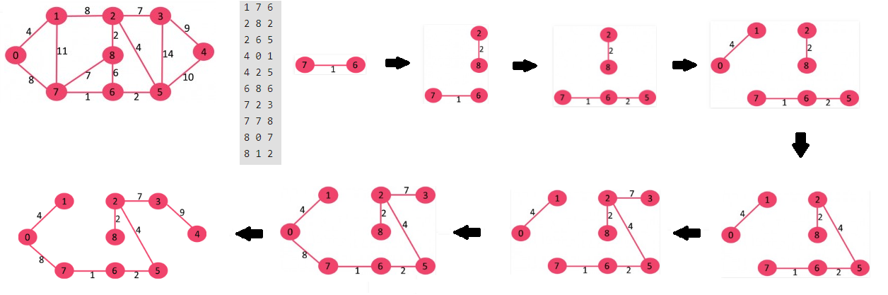

###### Code：KruskalMST

```cpp
#pragma once
#include<iostream>
#include<algorithm>
#include<vector>
using namespace std;

class Edge {
public:
	int weight;
	int src;
	int dst;
	Edge():weight(0),src(0),dst(0) {}
	Edge(int s,int d,int w ):weight(w),src(s),dst(d){}
};

class Graph
{
public:
	int V, E;//边数和顶点数
	std::vector<Edge> edges;

	Graph() :V(0), E(0) {}
	Graph(int v):V(v) {}
	void addEdge(Edge e);
	void KruskalMST();
};

void Graph::addEdge(Edge e) {
	edges.push_back(e);
	E++;
}

class DisjointSet {
public:
	int V;
	int *parent;
	int *rank;

	DisjointSet(int v) :V(v) {
		rank = new int[V];
		parent = new int[V];
		for (int i = 0; i < V; i++)
			parent[i] = i;
	}

	int find(int i);
	void merge(int i, int j);
};

int DisjointSet::find(int i) {
	if (parent[i] == i) return i;
	else {
		parent[i] = find(parent[i]);
		return parent[i];
	}
}

void DisjointSet::merge(int i, int j) {
	int iset = find(i);
	int jset = find(j);
	if (iset == jset) return;

	int irank = rank[iset];
	int jrank = rank[jset];
	if (irank==jrank)
	{
		parent[iset] = j;
		rank[jset]++;
	}
	else irank < jrank ? parent[iset] = j : parent[jset] = i;
}

int myCompare(Edge a, Edge b) {
	return a.weight < b.weight;
}

void Graph::KruskalMST() {
	vector<Edge> mstedges; // 存储mst的边
	
	// 1.对所有的边进行排序，从大到小排序
	sort(edges.begin(), edges.end(), myCompare);
	DisjointSet djs(V); // 创建并查集
	
	int i = 0; // 用来控制循环上限为所有边的数量
	int j = 0; // 用来控制循环下线为MST的边数量V-1
	while (j<V-1 && i<E )
	{
		// 2. 不断选择权值最小的边
		Edge edge = edges[i++];
		int x = djs.find(edge.src);
		int y = djs.find(edge.dst);
		if (x != y) {
			mstedges.push_back(edge);
			j++;
			djs.merge(x, y);
		}
		// 若属于同一集合则丢掉这条边
	}
	cout << "MST tree edges :*******************" << endl;
	for (auto it = mstedges.begin();it!=mstedges.end(); it++)
	{
		cout << (*it).src << "---" << (*it).dst << "---" << (*it).weight << endl;
	}
}
```

###### Test：KruskalMST

```cpp
#include "Graph.h"
int main(int argc, char ** argv) {
	Graph g(9);
	g.addEdge(Edge(0, 1, 4));
	g.addEdge(Edge(0, 7, 8));
	g.addEdge(Edge(1, 2, 8));
	g.addEdge(Edge(2, 8, 2));
	g.addEdge(Edge(1, 7, 11));
	g.addEdge(Edge(7, 8, 7));
	g.addEdge(Edge(7, 6, 1));
	g.addEdge(Edge(6, 8, 6));
	g.addEdge(Edge(6, 5, 2));
	g.addEdge(Edge(2, 5, 4));
	g.addEdge(Edge(2, 3, 7));
	g.addEdge(Edge(3, 5, 14));
	g.addEdge(Edge(3, 4, 9));
	g.addEdge(Edge(4, 5, 10));
	g.KruskalMST();
	system("pause");
}
```

### 3.3 Prim算法实现MST

示例：[原图来自](https://www.geeksforgeeks.org/kruskals-minimum-spanning-tree-algorithm-greedy-algo-2/)：

**原理**：1. 若图中有结点自己成环，删掉；若图中两相邻结点有多条边，只保留最小边。 2. 分成两个区域，已选区域和未选区域。开始：选取一点到已选区 。3. 已选区会有边去往未选区，优先选择最小的边，并移动相应的顶点到已选区域。再重复同样的步骤。

用邻接矩阵来表示图，对于未直接相连的点，用INF表示。数组selected[] = {}，数组unselected[] ={}，每次从unselected中选取路径最短的，非邻居节点的距离为INF，故不会被选取到。

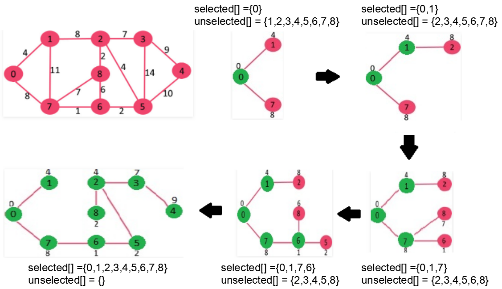

额，这里代码的具体实现，主要是如何检测最小边，我写的代码中通过遍历selected数组来选取最小边，复杂度较高。如图所示的这种方法，通过不断覆盖来判断一个点连接到mst的最小权重，更优化。

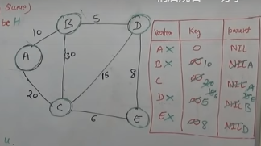


###### Code : Prim

```cpp
#pragma once
#include<iostream>
#include<vector>
using namespace std;

class Graph {
public:
	int V, E;
	vector<vector<int>> adj;
	Graph(int v):V(v) {
		for (int i = 0; i < v; i++)
		{
			vector<int> temp;
			for (int j = 0; j < v; j++)
			{
				temp.push_back(INT16_MAX);
			}
			adj.push_back(temp);
		}
	}
	void addEdge(int src, int dst, int weight);
	void PrimMST();
	vector<int> findmin(vector<bool> selected);
	void printMST(vector<int> mst, vector<int> weight);

};


void Graph::addEdge(int src, int dst, int weight) {
	adj[src][dst] = weight;
	adj[dst][src] = weight;
	E++;
}

void Graph::PrimMST() {
	vector<bool> selected(V,false);
	selected[0] = true;
	int i = 1; // 用于记录被选中的个数
	int key = 0; // 用于记录最新被选中的节点id
	vector<int> mst(V, -1);   // 存放父节点
	vector<int> weight(V, 0); // 存放MST权重
	while (i < V) {
		vector<int> a = findmin(selected);
		//a[0]:parent,a[1]:minid,a[2]:minvalue
		selected[a[1]] = true;
		mst[a[1]] = a[0];
		weight[a[1]] = a[2];
		key = a[1];
		i++;
	}
	printMST(mst, weight);
}
vector<int> Graph::findmin(vector<bool> selected) {
	int min = INT16_MAX;
	int min_id;
	int parent;
	for (int j = 0; j < V; j++){
		if (selected[j])
		{
			for (int i = 0; i < V; i++) {
				if (selected[i] == false && adj[j][i] < min) {
					min = adj[j][i];
					min_id = i;
					parent = j;
				}
			}
		}
	}
	vector<int> a{ parent,min_id,min };
	return a;
}


void Graph::printMST(vector<int> mst,vector<int> weight) {
	for (int i = 0; i < V; i++){
		cout << "weight:"<< weight[i]<<"  node:"<<i<<"---"<< mst[i] << endl;
	}
}
```

###### Test : Prim

```cpp
#include "Graph.h"
#include<iostream>
int main(int argc, char ** argv) {

	Graph g(9);
	g.addEdge(0, 1, 4);
	g.addEdge(0, 7, 8);
	g.addEdge(1, 7, 11);
	g.addEdge(1, 2, 8);
	g.addEdge(2, 8, 2);
	g.addEdge(7, 8, 7);
	g.addEdge(8, 6, 6);
	g.addEdge(7, 6, 1);
	g.addEdge(6, 5, 2);
	g.addEdge(2, 5, 4);
	g.addEdge(2, 3, 7);
	g.addEdge(3, 5, 14);
	g.addEdge(3, 4, 9);
	g.addEdge(4, 5, 10);
	g.PrimMST();
	system("pause");
}
```


## 四、拓扑排序Topological Sorting

拓扑排序：将**有向无环图**的顶点排成一个线性序列，如果一个图有环，则无法找到拓扑排序，因为环内的度不可能为0。另外，拓扑排序不唯一。

应用背景：

1. 任务流程图。例如，学习人工智能前需要先学习数学和编程…先穿裤子，再穿鞋
2. 课程安排，预编译库，树的层序遍历就是一种拓扑排序

### 4.1 两种理解

* 一种理解：[原图](https://www.cnblogs.com/bigsai/p/11489260.html/)

1. 找到所有顶点的入度，确定入度为0的顶点为起点，删掉该顶点及该顶点所有的出边

2. 重新统计所有顶点的入度，确定入度为0的顶点为起点，删掉该顶点和所有出边

3. 重复上述步骤，若有两个顶点度为0，随便选一个。

   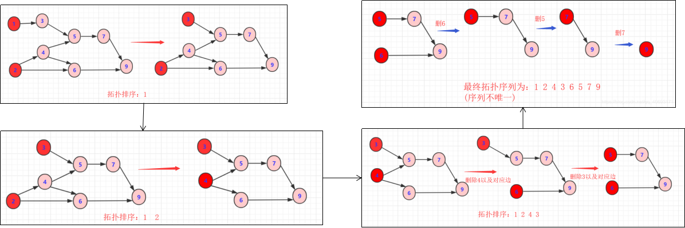

* 另一种理解：[原图](https://www.geeksforgeeks.org/topological-sorting/)：

1. 任意选择一个顶点开始DFS遍历，当一个结点的邻居结点都被访问后，将该结点压入栈中

2. 对未访问的节点进行相同操作，注意结果逆向排列。


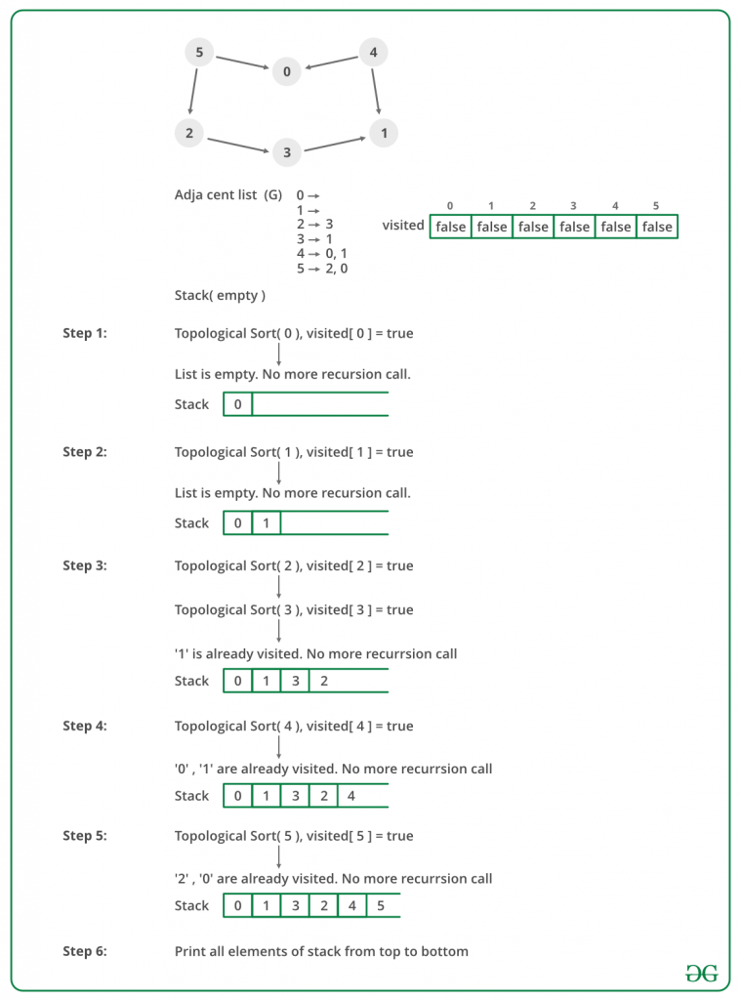

### 4.2 具体实现步骤

- 设置一个visited数组或者set，和一个stack。选取一个结点开始访问，放入visited中。对其子节点进行相同操作，当某一子节点不再有邻居结点时，将其放入stack。然后回到父节点，访问其他子节点。当一颗DFS树被遍历之后，遍历其他DFS森林，放入stack中，最后拓扑排序结果从stack中一一弹出。
- 其实，修改一下DFS代码即可

### 4.3 代码实现

###### Code：Topological Sorting

```cpp
#pragma once
#include <iostream>
#include <list>
#include <queue>
#include <stack>
#include <vector>
using namespace std;
class AdjlistGraph
{
	int V;
	vector<list<int>> adj;
public:
	AdjlistGraph(int _V) :V(_V) {
		for (int i = 0; i < _V; i++)
		{
			list<int> ls;
			ls.push_back(i);
			adj.push_back(ls);
		}
	}
	void addEdge(int a, int b);
	void topoSort();
	void topoSort(int start, vector<bool> &visited,stack<int> &topos);
};

void AdjlistGraph::addEdge(int a, int b) {
	adj[a].push_back(b);
}

void AdjlistGraph::topoSort() {
	vector<bool> visited(V, false);
	stack<int> topos;
	for (int i = 0; i < V; i++){
		if (visited[i] != true) {
			topoSort(i, visited,topos); 
		}
	}
	while (!topos.empty()>0)
	{
		cout << topos.top() << " ";
		topos.pop();
	}
}
// 一颗DFS树进行拓扑排序
void AdjlistGraph::topoSort(int start, vector<bool> &visited,stack<int> &topos) {
	stack<int> s;
	s.push(start);
	visited[start] = true;
	while (!s.empty())
	{
		int v = s.top();
		auto i = ++adj[v].begin();
		bool flag = false;
		for (; i != adj[v].end(); i++) {
			// 去找链表中的未访问结点，找到就退出
			if (!visited[(*i)])
			{
				flag = true;
				break;
			}
		}
		if (flag == true)
		{
			s.push(*i);
			visited[(*i)] = true;
		}
		else {
			topos.push(s.top());
			s.pop();
		}
	}
}
```

###### Test：Topological Sorting

```cpp
#include "AdjlistGraph.h"
int main(int argc, char ** argv) {
	AdjlistGraph g(8);
	g.addEdge(0, 2);
	g.addEdge(2, 4);
	g.addEdge(4, 6);
	g.addEdge(6, 7);
	g.addEdge(1, 3);
	g.addEdge(3, 4);
	g.addEdge(3, 5);
	
	cout << endl << "************" << endl;
	g.topoSort();
	cout << endl << "************" << endl;

	system("pause");
	return 0;
}
```


## 五、强连通分量 SCC

连通图：图中任意两个顶点之间有路可到达。

连通分量：无向图的某个极大子图符合连通图的性质，则称子图为连通分量。(无向图的连通分量很好写，修改DFS森林的代码即可，单个DFS本身就是一个连通分量。）

弱连通图：将有向图的所有边换成无向边后，若是连通的，则有向边为弱连通图

**强连通图：**有向图中任意两个顶点都存在相互到达的路径

**强连通分量（Strongly Connected Components）：**一张有向图G的极大强连通子图G‘。强连通分量和强连通分量之间不会形成环。若将每个强连通分量缩成一个点，则原图G得到的**Componet Graph**变成一张有向无环图**DAG**。（有向环是强连通分量）。

应用：很多个文件，化为多个强连通子图（多个模块），将原来的文件化为有向无环图，得到模块之间的依赖关系。如果修改了某一个模块，可以根据依赖关系判断其他模块是否需要修改，可以节约测试成本。

有两种常见的方法用于找到强连通分量：Kosaraju和Tarjan。

### 5.1 Kosaraju算法找SCC

#### 5.1.1 操作

kosaraju算法进行两次DFS，第一次在原图上进行，并在结点所有邻居节点都被访问后，将结点压入一个栈中，第二次DFS在G的反向图GT（将邻接矩阵转置）上进行，并且初始点选择栈中最上面的点，每次dfs所访问的点构成一个强连通分量。

#### 5.1.2 理解

Kosaraju的核心在于通过反转和节点退出DFS的时间，封死连通分量往外走的路。

**考虑反转：**Graph G的缩减图DAG，对DAG进行遍历会得到DFS树假设为**（C1->C2）**。而我们希望每次搜索都控制在SCC区域内，当C1结束后不再进入C2。如何做到呢？只要反向G得到GT。GT和G的SCC完全相同。对GT进行DAG，得到DFS树即**（C1<-C2）**，C1无法到达C2，这样就封死了C1往C2走的路。

下一步就是如何确保C1优先于C2被访问以防止C2再走到C1呢？

**考虑退出DFS的时间（finishtime）**：若G的DFS从**C1->C2**，则C1中至少有一个顶点A，会在C2中所有顶点都DFS结束之后才退出DFS（这个点往往是SCC之间的连接点，比如图中的1，6，7。1会在C2进行DFS之后才退出DFS），因此C2先结束，将其被压入栈中，A会在C2之后被压入栈中。当反向G后，从A先栈中弹出，先于C2进行DFS，而A所在的这个C1，由于C1<-C2，已经无法通过DFS到达C2，只能在C1内部进行DFS，因而不会产生SCC交叉。

简单地说，第一步对G进行DFS，找到原父点和原子SCC的顺序（根据DFS的退出时间）。第二步反向G，得到GT。原父点所在的SCC变成新子SCC，根据步骤一所得的顺序，先根据原父点对新子SCC进行DFS，再对原子SCC进行DFS，这样就不会串门啦~ 简单示例 : G：DFS，得到stack= [C2 1 6 C4 7|，GT：DFS(7)，DFS(C4),DFS(1),DFS(C2)

**复杂度分析：**两次DFS，时间复杂度O（E+V），一个stack，空间复杂度O（V）

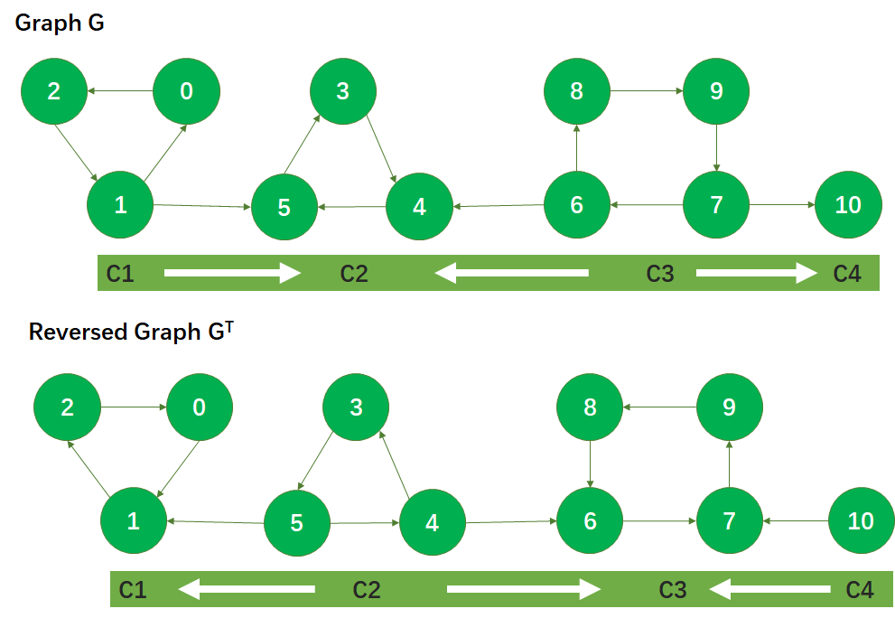

#### 5.1.3 具体例子

DFS G：只要顶点无路可走，就被压入stack中

- 初始化：visited=[]，stack=[],stack用于从小到大记录finish time

- start=0，DFS：0->2->1->5->3->4,没路了，4压入栈，{5,3,1,2,0}同理。

  visited=[0,2,1,5,3,4]，stack=[4,3,5,1,2,0]

- start=8，DFS：8-->9->7->6,没路了

  visited=[0,2,1,5,3,4,8,9,7,6]，stack=[4,3,5,1,2,0,6]

- DFS：7->10，没路了

  visited=[0,2,1,5,3,4,8,9,7,6,10]，stack=[4,3,5,1,2,0,6,10,7,9,8]

DFS GT：按照stack的弹出顺序DFS

- 初始化：visited=[]，stack=[4,3,5,1,2,0,6,10,7,9,8]

- start=8，DFS：8->6->7->9，得到一个SCC

  visited=[8,6,7,9]，79visited，故取start=10

- start=10，DFS：10，得到一个SCC，6visited，故取start=0

  visited=  [8,6,7,9,10]

- start=0，DFS：0->1->2，得到一个SCC，12visited，故取start=5

  visited=  [8,6,7,9,10,0,1,2]

- start=5，DFS：5->4->3，得到一个SCC，43visited，stack空，结束

  visited=  [8,6,7,9,10,0,1,2,5,4,3]     共记4个SCC

#### 5.1.4 代码实现

###### Code：Kosaraju

```cpp
#pragma once
#include<list>
#include<stack>
#include <vector>
#include<iostream>
using namespace std;
class Graph {
	int V;
	vector<list<int>> adj;
public:
	Graph(int _v) :V(_v) {
		for (int i = 0; i < _v; i++)
		{
			list<int> ls;
			adj.push_back(ls);
		}
	}
	void addEdge(int a, int b);
	void DFS(int start, vector<bool>& visited);
	void DFS(int start, vector<bool>& visited, stack<int> &order);
	Graph getTranspose();
	void getSCC();
};

void Graph::addEdge(int a, int b) {
	adj[a].push_back(b);
}
// 用于第二次DFS输出SCC
void Graph::DFS(int start, vector<bool>& visited) {
	stack<int> s;
	s.push(start);
	std::cout << start << " ";
	visited[start] = true;

	while (!s.empty())
	{
		int v = s.top();
		auto i = adj[v].begin();
		bool flag = false;
		for (; i != adj[v].end(); i++)
		{
			if (!visited[(*i)]) {
				flag = true;
				break;
			}
		}
		if (flag == true)
		{
			s.push(*i);
			std::cout << *i << " ";
			visited[(*i)] = true;
		}
		else {
			s.pop();
		}
	}
}
// 用于第一次DFS记录节点退出顺序
void Graph::DFS(int start, vector<bool>& visited,stack<int> &order) {
	stack<int> s;
	s.push(start);
	visited[start] = true;

	while (!s.empty()){
		int v = s.top();
		list<int>::iterator i = adj[v].begin();
		bool flag = false;
		for (; i != this->adj[v].end(); i++)
		{
			if (!visited[*i]) {
				flag = true;
				break;
			}
		}
		if (flag == true)
		{
			s.push(*i);
			visited[*i] = true;
		}
		else {
			order.push(s.top());
			s.pop();
		} 
	}
}

Graph Graph::getTranspose() {
	Graph g(V);
	for (int i = 0; i < V; i++){
		list<int>::iterator it = this->adj[i].begin();
		for (; it!=adj[i].end(); it++){
			g.adj[*it].push_back(i);
		}
	}
	return g;
}

void Graph::getSCC() {
	// 第一轮DFS
	vector<bool> visited(V, false);
	stack<int> firstorder; // 根据退出DFS的时间存储节点。
	for (int i = 0; i < V; i++){
		if (visited[i] != true){
			DFS(i, visited, firstorder);
		}
	}
	// 第二轮DFS
	Graph g = this->getTranspose();
	vector<bool> visitedtwice(V, false);
	while (!firstorder.empty()){
		int val = firstorder.top();
		if (visitedtwice[val]==false)
		{
			g.DFS(val, visitedtwice);
			cout << endl;
		}
		firstorder.pop();
	}
}
```


###### Test：Kosaraju

```cpp
#include<iostream>
#include "Graph.h"
using namespace std;
int main(int argc, char** argv) {
	Graph gra(11);
	gra.addEdge(0, 2);
	gra.addEdge(2, 1);
	gra.addEdge(1, 0);
	gra.addEdge(1, 5);
	gra.addEdge(5, 3);
	gra.addEdge(4, 5);
	gra.addEdge(3, 4);
	gra.addEdge(6, 4);
	gra.addEdge(6, 8);
	gra.addEdge(8, 9);
	gra.addEdge(9, 7);
	gra.addEdge(7, 6);
	gra.addEdge(7, 10);

	gra.getSCC();

	system("pause");
	return 0;
}
```

### 5.2 Tarjan算法找SCC

#### 5.2.1 简单介绍

**Tarjan的核心在于SCC中最先被访问的顶点First，按照访问顺序它能追溯到的祖先就是自身。**而SCC中的其他点则可追溯祖先到First。于是它用dfs[]记录顶点的访问顺序，用low[]来记录它能追溯的最早祖先。难点在于这个追溯的过程，假设a->b->c->d->a，当d追溯到了a，则b,c的追溯情况也会发生变化，这可以用递归解决，当一个顶点的某个邻居节点都被DFS之后，立马更新该顶点，也就是DFS(a)->DFS(b)->DFS(c)->DFS(d)->update(low[d])->update(low[c])->update[low(b)]->find(low(a)==dfs(a))->判断a是FIRST。最后讨论关于SCC的输出，只要用栈来记录访问到的点，当判断出First后，将low相同的点从栈中统统弹出即可。

**可以关注一下：Tarjan的DFS采用先DFS邻居顶点，再更新自身顶点属性的方法（常见的递归写法，需掌握）**

#### 5.2.2 算法流程                                                                  

数据结构：

- 变量time：记录访问到第几个顶点了。                               

- dfn[i]：记录顶点是第几个被DFS到的，每个顶点的时间戳，初始都设为-1

- low[i]：顶点在它的SCC中，能找到的最小时间戳，也就是（ i 能找到的最早回边）

- stack[]：记录当前已经访问过，且未被弹出的节点。

假设：

1. 开始：选择一个点开始DFS，每到unvisited的点v就预设dfn[v]=low[v]，压入stack

2. 判断v的邻居k是否visited(dfs[k]==-1)

   - 若 k not visited，就DFS(k)，并在结束DFS后，判断是否满足low[k]<low[v]，是则更新low[v]，让low[v]=low[k]

   - 若 k visited 且 k in stack，是则必有k为v的祖先，low[k]<low[v]，令low[v]=min(low[v],low[k])。

     （补充1：对于k visited but not in stack的情况，说明这个点已经被早早弹出去了，属于其他SCC
     
     补充2：这里还有另一种写法是令low[v]=min(low[v],dfn[k])。在这里都可以使用。但是对于求割点的情况，只能用low[v]=min(low[v],dfn[k])，否则会跳过割点回溯到更远处。用这种写法更加符合它的定义。）

3. 当v的所有邻居都结束访问后，也就是low[v]被更新到最小的情况，判断dfs[i]==low[i]，若是则说明该点为SCC的根节点（也就是是指SCC中被最先访问的点，因为low[v]不可能更小了），将stack中所有low为low[i]的元素弹出，成为一个SCC


#### 5.2.3 例子

图中(x,y)表示(dfn[i],low[i])

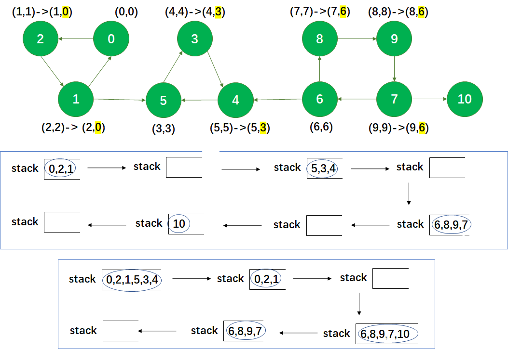

#### 5.2.4 代码实现 

###### Code：Tarjan for SCC

```cpp
#pragma once
#include<vector>
#include<list>
#include<algorithm>
using namespace std;

class Graph {
public:
	int V;
	vector<list<int>> adj;
	Graph(int v) :V(v) {
		for (int i = 0; i < V; i++){
			list<int> ls;
			adj.push_back(ls);
		}
	}
	void addEdge(int v, int w);

	void getSCC();
	void SCC(int start, vector<int>& dfn, vector<int>& low, vector<int>& s, int& time);
};
void Graph::addEdge(int v, int w) {
	adj[v].push_back(w);
}
void Graph::getSCC() {
	vector<int> dfn(V, -1);
	vector<int> low(V, -1);
	vector<int> s;
	int time = 0;
	int i = 0;
	for (int i = 0; i < V; i++)
	{
		if(dfn[i] == -1) {
			SCC(i, dfn, low, s, time);
		}
	}
}
void Graph::SCC(int start, vector<int>& dfn, vector<int>& low, vector<int>& s, int& time){
	dfn[start] = time++;
	low[start] = dfn[start];
	s.push_back(start);
	
 	for (auto it = adj[start].begin(); it != adj[start].end(); it++){
		if (dfn[*it] == -1) { //unvisited
			SCC(*it, dfn, low, s, time);
			low[start] = min(low[start], low[*it]);
		}
		else{
			auto sit = find(s.begin(), s.end(), *it);
			if (sit != s.end()) // 元素visited并且in stack
			{
				low[start] = min(low[start], low[*it]);
			}
		}
	}
	if (dfn[start] == low[start]){
		while (!s.empty()&&(low[s.back()] == low[start])) {
			cout << s.back() << " ";
			s.pop_back();
		}
		cout << endl;
	}
}
```

###### Test：Tarjan for SCC

```cpp
#include<iostream>
#include "Graph.h"

using namespace std;

int main(int argc, char** argv) {
	Graph gra(11);
	gra.addEdge(0, 2);
	gra.addEdge(2, 1);
	gra.addEdge(1, 0);
	gra.addEdge(1, 5);
	gra.addEdge(5, 3);
	gra.addEdge(4, 5);
	gra.addEdge(3, 4);
	gra.addEdge(6, 4);
	gra.addEdge(6, 8);
	gra.addEdge(8, 9);
	gra.addEdge(9, 7);
	gra.addEdge(7, 6);
	gra.addEdge(7, 10);

	gra.getSCC();
	system("pause");
	return 0;
}
```


#### 5.2.5 和Kosaraju比较

Kosaraju两次DFS，时间复杂度也是O(V+E)。Tarjan只用对原图进行一次DFS，时间复杂度也是O(V+E)，但常数项更小。在实际的测试中，Tarjan算法的运行效率比Kosaraju算法高30%左右。

#### 5.2.5 割点、桥、双连通分量

**割点Articulation Point(AP)**：无向连通图，去掉一个点，图就不再连通，则该点是**割点**。比如图中顶点1

**桥Bridge：**无向连通图中，去掉某条边，图不连通，则该边为桥。比如图中连接16的边。


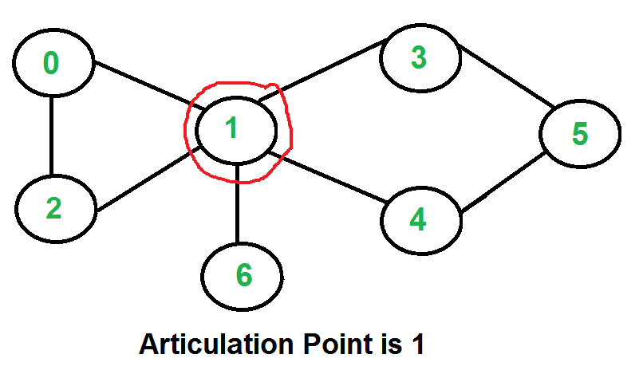

##### 5.2.5.1 割点AP的求法：

 **粗糙的方法：**是一个接一个地删除所有顶点，并查看顶点的删除是否会导致图形断开，用DFS或BFS，复杂度太高O（V*(V+E)）。

**牛掰的方法**：用Tarjan啊~

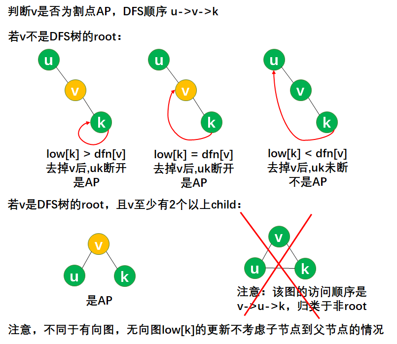

因此，从图中可以看出，v->k,割点v满足以下条件：

- v是DFS树的root，并且在DFS树中至少有两个孩子
- v不是DFS树的root，且**low[k]>=dfn[v]**

DFS树的叶子不可能是割点


##### 5.2.5.2  桥Bridge 的求法


因此，从图中可以看出，v->k,桥vk满足以下条件：**low[k]>dfn[v]**

##### 5.2.5.3 例子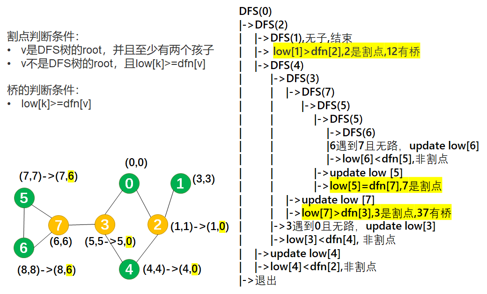

##### 5.2.5.4 双连通分量BCC的概念和求法

- 点双连通：删掉一个点之后，图仍联通--->无割点--->消除割点的办法：任意两边必在一个环中->->任意两点至少存在两条无公共顶点的路径（除起点和终点）
- 边双连通：删掉一条边之后，图仍联通--->无桥--->消除桥的办法：每条边都在至少一个环内->任意两点至少存在2条无公共便的路径

**点双连通分量v-BCC**：无向图的极大点双连通子图。

求法：求解点双连通分量，可以先求割点，但是割点属于多个v-BCC，其余顶点只属于一个v-BCC。这在输出时有困难。解决办法：在DFS时，将DFS树的边压入栈中，找到割点后，开始取栈中和割点有关的边

开一个栈，tarjan递归访问到某个点的时候入栈，然后每次经过一条边(x,y)(x,y)而且x满足low[y]>=dfn[x]low[y]>=dfn[x]的时候不管x是不是割点，都把栈里的元素一一弹出，直到把y弹出，所有弹出的点，再加上x，构成一个点双。


**边双连通分量e-BCC**：无向连通图的极大边双连通子图。

**求法**：用Tarjan求出无向图中所有的桥，将无向图分成多块，每块都是e-BCC，在访问时不走桥即可。将边双连通分量缩点后，得到的边都是桥。

##### 5.2.5.5 代码实现

###### Code：AP-Tarjan 

```cpp
#pragma once
#include<vector>
#include<list>
#include<algorithm>
using namespace std;

class Graph {
public:
	int V;
	vector<list<int>> adj;
	Graph(int v) :V(v) {
		for (int i = 0; i < V; i++) {
			list<int> ls;
			adj.push_back(ls);
		}
	}
	void addEdge(int v, int w);

	void getAP();
	void AP(int v, vector<int>& dfn, vector<int>& low, int& time, vector<int>& parent);
};
void Graph::addEdge(int v, int w) {
	adj[v].push_back(w);
	adj[w].push_back(v);
}
void Graph::getAP() {
	vector<int> dfn(V, -1);
	vector<int> low(V, -1);
	vector<int> parent(V, -1);
	int time = 0;
	int i = 0;
	for (int i = 0; i < V; i++)
	{
		if (dfn[i] == -1) {
			AP(i, dfn, low, time,parent);
		}
	}
}
void Graph::AP(int v, vector<int>& dfn, vector<int>& low, int& time, vector<int>& parent) {
	dfn[v] = time++;
	low[v] = dfn[v];

	int child = 0;//记录当前节点的DFS孩子数

	for (auto it = adj[v].begin(); it != adj[v].end(); it++) {
		if (dfn[*it] == -1) { //unvisited
			parent[*it] = v;
			child++;
			AP(*it, dfn, low,time,parent);
			low[v] = min(low[v], low[*it]);
		}
		else {
			if(*it!=parent[v])	 low[v] = min(low[v], dfn[*it]);
			//这里注意啊，不能让他回溯到祖先的祖先，这样会跳过割点
			//也不能回溯到父节点，这样还搞啥子哦
		}
	}
	if (parent[v] == -1) { // v是root的情况
		if (child > 1) cout << v << " ";
	}else if (parent[parent[v]] != -1 && low[v] >= dfn[parent[v]]) {
		// parent[v]非root节点是割点的情况
		cout << parent[v] << " ";
	}
}
```

###### Code：Bridge-Tarjan 

```cpp
#pragma once
#include<vector>
#include<list>
#include<algorithm>
using namespace std;

class Graph {
public:
	int V;
	vector<list<int>> adj;
	Graph(int v) :V(v) {
		for (int i = 0; i < V; i++) {
			list<int> ls;
			adj.push_back(ls);
		}
	}
	void addEdge(int v, int w);

	void getBridge();
	void Bridge(int v, vector<int>& dfn, vector<int>& low, int& time, vector<int>& parent);
};
void Graph::addEdge(int v, int w) {
	adj[v].push_back(w);
	adj[w].push_back(v);
}
void Graph::getBridge() {
	vector<int> dfn(V, -1);
	vector<int> low(V, -1);
	vector<int> parent(V, -1);
	int time = 0;
	int i = 0;
	for (int i = 0; i < V; i++)
	{
		if (dfn[i] == -1) {
			Bridge(i, dfn, low, time,parent);
		}
	}
}
void Graph::Bridge(int v, vector<int>& dfn, vector<int>& low, int& time, vector<int>& parent) {
	dfn[v] = time++;
	low[v] = dfn[v];

	for (auto it = adj[v].begin(); it != adj[v].end(); it++) {
		if (dfn[*it] == -1) { //unvisited
			parent[*it] = v;
			Bridge(*it, dfn, low,time,parent);
			low[v] = min(low[v], low[*it]);
		}
		else {
			if(*it!=parent[v])	 low[v] = min(low[v], dfn[*it]);
			//这里注意啊，不能让他回溯到祖先的祖先，这样会跳过割点
			//也不能回溯到父节点，这样还搞啥子哦
		}
	}
	if (parent[v]!=-1 && low[v] > dfn[parent[v]])
		cout << v << "-" << parent[v] << endl;
}
```

###### Test：Tarjan for AP/Bridge

```cpp
#include<iostream>
#include "Graph.h"
using namespace std;

int main(int argc, char** argv) {
	Graph gra(8);
	gra.addEdge(0, 2);  gra.addEdge(2, 1);	gra.addEdge(3, 0);
	gra.addEdge(2, 4);	gra.addEdge(4, 3);	gra.addEdge(3, 7);	
    gra.addEdge(7, 5);	gra.addEdge(6, 7);	gra.addEdge(6, 5);
	gra.getAP();
    gra.getBridge();
	system("pause");
	return 0;
}
```


## 六、最短路径

**最短路径问题shortest path problem**：找到两点之间边权和最短的路。

- **单源最短路径问题**：固定一个顶点为源点，求源点到其他每个点的最短路径
  - 边权非负：**Dijkstra** --- O(V^2)，可优化O(VlogV+E)
  - 边权可为负，但不能有负环：**Bellman-Ford** --- O(VE)
  - Bellman-Ford改进：**SPFA**：复杂度不稳定，但有些情况真的好用。

- **多源最短路径问题：**计算每个点对之间的最短路
  - **Floyd-Warshall** ---O(V^3)

### 6.1 Dijkstra 

还记得Prim算法么，就分俩区找最短边连起来的那个。Dijkstra类似Prim算法，用贪心做的。注意Dijkstra算法不可以处理负边！

#### 6.1.1 算法流程

以给定源为根。分两个区，A区存放**SPT(Shortest path tree)**上的点，B区存放非SPT树上的点。每次执行，从B区找到一个到源距离最短的点。

**流程：**

- 创建空 set A以追踪SPT上的点。
- 创建距离数组，并初始化所有距离为无穷 distance(V,INFINITE)，修改源的距离为0。
- 当set A未满员
  - 选择一个最小距离且不处于set A的点u
  - 将u吸收到A区
  - 更新u的所有邻居节点的距离值。具体通过迭代所有顶点，对于u的每个邻居顶点v，if distance[u]+edgeweight(u->v) < distance[v],then update distance[v].

**复杂度分析：**

​    要找到去往V-1个顶点的路径，在每次查找过程中，会遍历其邻居节点，最坏的情况，邻居节点有V-1个，因此最坏时间复杂度O(V^2)。如果优化查找最小距离点的算法，比如用斐波那契堆实现，则复杂度降低为O(VlogV+E)。斐波那契堆回头再补充啊~

**缺点分析：**

​    Dijkstra算法不可以处理负边。因为默认set A中的点，都已经找到了从源点到这个点的最短路径。若存在负边，则默认不成立，加上负边后，可以比最短路径更短。

#### 6.1.2 例子

[原图地址](https://www.geeksforgeeks.org/dijkstras-shortest-path-algorithm-greedy-algo-7/)

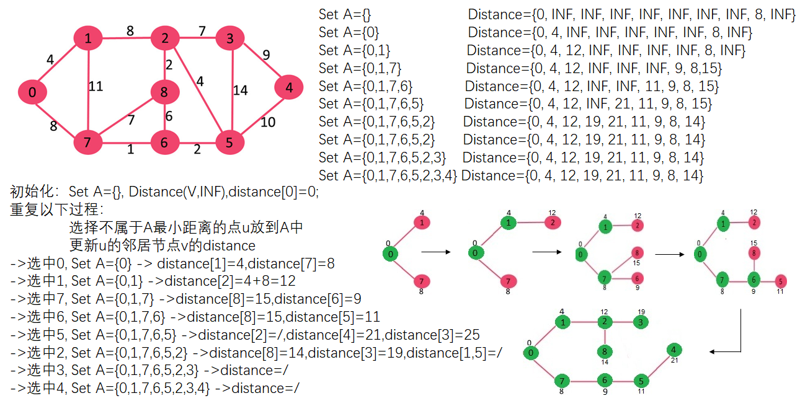

#### 6.1.3 代码

###### Code：Dijkstra(未用堆优化)

```cpp
#pragma once
#include<set>
#include<iostream>
#include<vector>
#include<list>
#include<algorithm>
using namespace std;
#define INF INT_MAX

class Node {
public:
	int dst;
	int weight;
	Node(int d, int w):dst(d),weight(w) {}
};

class Graph {
public:
	int V;
	vector<list<Node>> adj;
	Graph(int v) :V(v) {
		for (int i = 0; i < v; i++)
		{
			list<Node> ls;
			adj.push_back(ls);
		}
	}
	void addEdge(int a, int b,int weight);
	vector<int> Dijkstra(int start);
};

void Graph::addEdge(int a, int b,int weight) {
	adj[a].push_back(Node(b, weight));
	adj[b].push_back(Node(a, weight));
}

vector<int> Graph::Dijkstra(int start) {
	set<int> A;
	vector<int> distance(V, INF);
	distance[start] = 0;
	while (A.size()<V)
	{
		//int minu = findmin(vector<int> distance);
		int minu;
		int minval = INF;
		for (int i = 0; i < V;i++) {
			if (A.find(i)==A.end() && distance[i] <= minval) {
				minu = i;
				minval = distance[i];
			}
		}

		A.insert(minu);

		//updatedistance(int minvertex);
		list<Node>::iterator it = adj[minu].begin();
		for (; it != adj[minu].end(); it++) {
			distance[(*it).dst] = min(distance[minu] + (*it).weight, distance[(*it).dst]);
		}
	}
	return distance;
}
```

###### Test：Dijkstra

```cpp
#include<iostream>
#include "Graph.h"
using namespace std;
int main(int argc, char** argv) {
	Graph g(9);
	g.addEdge(0, 1, 4);	g.addEdge(0, 7, 8);	g.addEdge(1, 7, 11);
	g.addEdge(1, 2, 8);	g.addEdge(2, 8, 2);	g.addEdge(7, 8, 7);
	g.addEdge(8, 6, 6);	g.addEdge(7, 6, 1);	g.addEdge(6, 5, 2);
	g.addEdge(2, 5, 4);	g.addEdge(2, 3, 7); g.addEdge(3, 5, 14);
	g.addEdge(3, 4, 9);	g.addEdge(4, 5, 10);

	vector<int> a = g.Dijkstra(0);
	for (int k=0;k<9;k++){
		cout << k << " distance:" << a[k]<<endl;
	}

	system("pause");
	return 0;
}
```


### 6.2 Bellman-Ford

Dijkstra无法处理负边的情况，BF算法可以，但算法复杂度高于Dijkstra。

循环 i from 1 to V-1次（每次循环都是去找从源点出发最多经过 i  条边能找到的最短路径长度），每次循环下都遍历所有的边，判断是否有权值和更小的情况，有就更新，直到距离数组不发生变化为止。不适用于有负环的情况。有点暴力？待学了DP再看一遍。

#### 6.2.1 算法流程

**流程：**

创建距离数组，并初始化所有距离为无穷 distance(V,INFINITE)，修改源的距离为0。

将所有边放到edgelist。

循环以下操作V-1次：// 每次循环都是去找从源点出发最多经过i 条边能找到的最短路径长度

- 对于edgelist中的每条边，判断 if distance[u]+edgeweight(u-v) < distance[v],then update distance[v]=distance[u]+edgeweight(u-v) .
- 若这次循环没有更新distance[]，则结束

那么问题来了，如果循环V-1次后，退出循环，可以确定是最短路径吗？

答：若存在负环（环的权值和为负数），最短距离会陷入死局。具体看图例。如果环的权值和是非负数，则可行。

拓展：Bellman-Ford算法可以检测权值和为负数的环，只要在循环结束之后再进行一次判断，如果还存在distance[u]+edgeweight(u-v) < distance[v]，就能找到负环

**复杂度分析：**

对V-1次循环，每次循环对edgelist遍历，复杂度为O(E*(V-1))=O(VE),最惨的情况：边数最大，E=V(V-1)/2，复杂度O(V^3)。

**缺点分析：**无法解决存在负环的情况

#### 6.2.2 例子

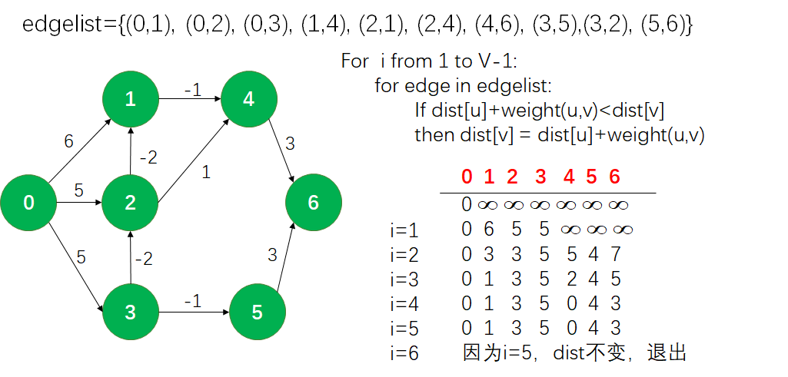


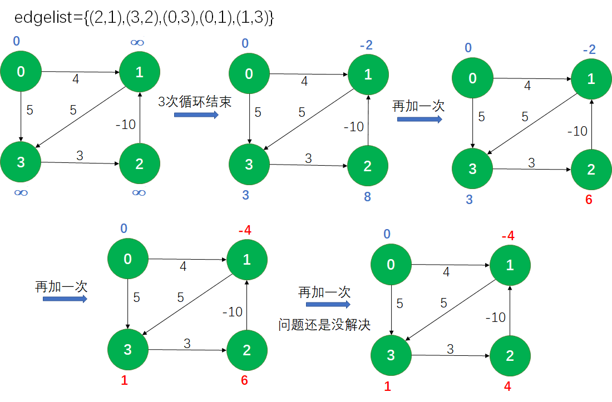

#### 6.2.3 代码

###### Code：Bellman-Ford

```cpp
#pragma once
#include<iostream>
#include<vector>
using namespace std;

class Edge {
public:
	int src;
	int dst;
	int weight;
	Edge(int s, int d, int w) :src(s), dst(d), weight(w) {}
};

class Graph {
public:
	int V;
	vector<Edge> edgelist;

	Graph(int v):V(v) {}
	void addEdge(int a, int b, int weight);
	vector<int> BellmanFord(int start);
};
void Graph::addEdge(int a, int b,int weight) {
	edgelist.push_back(Edge(a,b,weight));
}

vector<int> Graph::BellmanFord(int start) {
	vector<int> distance(V, INT_MAX);
	distance[start] = 0;
	for (int i = 1; i < V; i++){
		vector<Edge>::iterator eit;
		bool flag = false;
		for (eit=edgelist.begin();eit!=edgelist.end();eit++){
			if (distance[(*eit).src] + (*eit).weight < distance[(*eit).dst]) {
				distance[(*eit).dst] = distance[(*eit).src] + (*eit).weight;
				flag = true; // distance被更新
			}
		}
		if (!flag) 	break;
	}
	return distance;
}
```

###### Test：Bellman-Ford

```cpp
#include<iostream>
#include "Graph.h"

using namespace std;
int main(int argc, char** argv) {
	Graph g(7);
	g.addEdge(0, 1, 6);		g.addEdge(0, 2, 5);		g.addEdge(0, 3, 5);
	g.addEdge(2, 1, -2);	g.addEdge(3, 2, -2);	g.addEdge(1, 4, -1);
	g.addEdge(2, 4, 1);		g.addEdge(4, 6, 3);		g.addEdge(3, 5, -1);
	g.addEdge(5, 6, 3);
	vector<int> distance = g.BellmanFord(0);
	for (auto i = distance.begin(); i < distance.end(); i++){
		cout << *i << " ";
	}
	system("pause");
	return 0;
}
```


### 6.3 队列优化的Bellman-Ford

这个算法吧，Shortest Path Faster Algorithm：优化了Bellman-Ford，减少其中冗余的判断。加了个队列来维护。但是它的时间复杂度也没有优化很多。

#### 6.3.1 算法流程

**算法流程：**

- 初始：将源点加入队列

- 每次从队列中取出一个顶点，并对邻居点进行更新（方法和Bellman-Ford一样），更新成功就加入队列，不更新就不用加入。重复过程，直到队列为空。

  这样就排除了没有更新过的点。

**负环判断**：

只要一个顶点进入队列次数>n次，则存在负权值回路。

**复杂度分析：**

SPFA的论文中复杂度分析被打死了，没有快很多，玄学复杂度。但有些情况真的好用。

###### Code：SPFA

```cpp
#pragma once
#include<iostream>
#include<vector>
#include<list>
#include<queue>
using namespace std;

class Node {
public:
	int dst;
	int weight;
	Node(int d, int w):dst(d), weight(w) {}
};

class Graph {
public:
	int V;
	vector<list<Node>> adj;

	Graph(int v):V(v) {
		for (int i = 0; i < v; i++){
			list<Node> ls;
			adj.push_back(ls);
		}
	}
	void addEdge(int a, int b, int weight);
	vector<int> SPFA(int start);
};
void Graph::addEdge(int a, int b,int weight) {
	adj[a].push_back(Node(b,weight));
}

vector<int> Graph::SPFA(int start) {
	vector<int> distance(V, INT_MAX);
	queue<int> que;
	distance[start] = 0;
	que.push(start);
	while (!que.empty()) {
		int u = que.front();
		que.pop();
		for (auto eit=adj[u].begin();eit!=adj[u].end();eit++){
			if (distance[u] + (*eit).weight < distance[(*eit).dst]) {
				distance[(*eit).dst] = distance[u] + (*eit).weight;
				que.push((*eit).dst);
			}
		}
	}
	return distance;
}
```

###### Test：SPFA

```cpp
#include<iostream>
#include "Graph.h"

using namespace std;
int main(int argc, char** argv) {
	Graph g(7);
	g.addEdge(0, 1, 6);		g.addEdge(0, 2, 5);		g.addEdge(0, 3, 5);
	g.addEdge(2, 1, -2);	g.addEdge(3, 2, -2);	g.addEdge(1, 4, -1);
	g.addEdge(2, 4, 1);		g.addEdge(4, 6, 3);		g.addEdge(3, 5, -1);
	g.addEdge(5, 6, 3);
	vector<int> distance = g.SPFA(0);
	for (auto i = distance.begin(); i < distance.end(); i++){
		cout << *i << " ";
	}
	system("pause");
	return 0;
}
```

### 6.4 Floyd-Warshall

先看例子，再看流程

#### 6.4.1 算法流程

**流程：**

输入：原图矩阵A(-1)。

- 创建矩阵A(0)，填入A(-1)中0所在的行和列以及所有对角线元素。也就是令A(0)[0,i]=A(-1)[0,i]，A(0)[i,0]=A(-1)[i.0]，A(0)[i,i]=0

- 比较以0为中间点的最短路径，也就是令A(0)[i,j]=min{A(-1)[i,j]，A(-1)[i,0]+A(-1)[0,j]}。若在A(-1)中，存在A[i,j] > A[i,0]+A[0,j]，则说明通过中间点的路径比两点直达的路径更短。新创建的矩阵A(0)中需要填入二者中更小的一个。
- 对于其他所有的顶点进行类似操作，共新建V个矩阵，每次都根据上一次得到的矩阵结果判断，A(k)[i,j]=min{A(k-1)[i,j]，A(k-1)[i,0]+A(-1)[0,j]}

**复杂度分析：**

共对V个矩阵进行了V*V次判断,O(n^3)

#### 6.4.2 例子

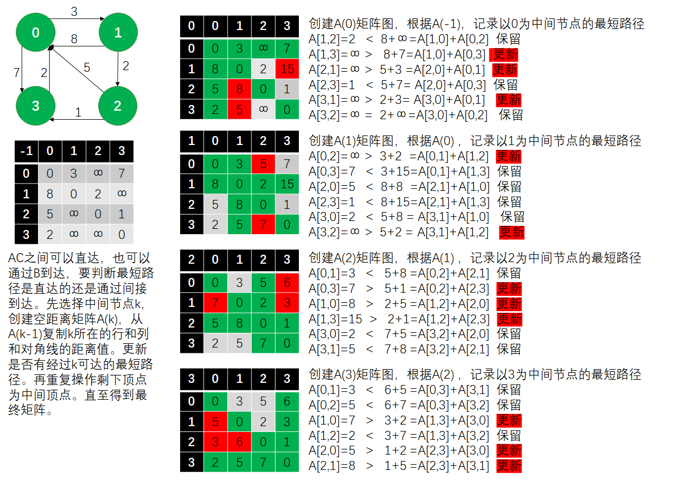

#### 6.4.3 代码实现

###### Code: Floyd-Warshall

```cpp
#pragma once
#include<iostream>
#include<vector>
#include<algorithm>
using namespace std;
#define INF INT_MAX

class Graph {
public:
	int V;
	vector<vector<int>> adj;

	Graph(int v):V(v) {
		for (int i = 0; i < v; i++){
			vector<int> ls(V,INF);
			adj.push_back(ls);
		}
		for (int i = 0; i < v; i++)
		{
			adj[i][i] = 0;
		}
	}
	void addEdge(int a, int b, int weight);
	vector<vector<int>> FloydInside(int k, vector<vector<int>> matrx);
	vector<vector<int>> Floyd();
};
void Graph::addEdge(int a, int b,int weight) {
	adj[a][b] = weight;
}

vector<vector<int>> Graph::Floyd() {
	vector<vector<int>> res=adj;
	for (int i = 0; i < V; i++){
		res =FloydInside(i, res);
	}
	return res;
}
vector<vector<int>> Graph::FloydInside(int k, vector<vector<int>> matrx) {
	vector<vector<int>> newmatra=matrx;
	for (int i = 0; i < V; i++){
		for (int j = 0; j < V; j++){
			if (i == j || i == k || j == k) continue;
			else if (matrx[i][k] != INF && matrx[k][j] != INF && (matrx[i][j] > matrx[i][k] + matrx[k][j]))
					newmatra[i][j] = matrx[i][k] + matrx[k][j];
		}
	}
	return newmatra;
}
```

###### Test：Floyd-Warshall

```cpp
#include<iostream>
#include "Graph.h"

using namespace std;
int main(int argc, char** argv) {
	Graph g(4);
	g.addEdge(0, 1, 3);	g.addEdge(0, 3, 7); g.addEdge(1, 0, 8);
	g.addEdge(1, 2, 2);	g.addEdge(2, 0, 5);	g.addEdge(2, 3, 1);
	g.addEdge(3, 0, 2);
	vector<vector<int>> a = g.Floyd();
	for (int i = 0; i < 4; i++){
		for (int j = 0; j < 4; j++){
			cout << a[i][j] << " ";
		}
		cout << endl;
	}
	system("pause");
	return 0;
}
```

### 6.5 Johnson

处理多源最短路径问题有多种思路，除了Floyd-Warshall还有暴力解，对于无负边的情况，在Dijkstra外面在套一层循环。对于有负边的情况，在Bellman-Ford外面套一层循环，若不考虑Dijkstra的堆优化，这三种情况的时间复杂度都为O(n^3)，但是~Dijkstra可用堆优化成O(VlogV+E),~所以套一层可以优化成O(V*(VlogV+E))，又但是，Dijkstra无法处理存在负边的情况，那把所有边都加k，使所有边都为正可行吗？No,要考虑到步数。最短路径会加上k * 步数。这时，Johnson提出了Johnson算法，加上一个数，令边都为正，而不影响最短路径。他的辅助线是一个可以到达所有顶点且距离为0的虚拟点。

#### 6.5.1 原理

**边权赋值原理：让uv边权加上uv到虚拟点S的距离差**

假设新建虚拟点 S 到 u 的最短距离为$f_u$，单源最短距离可用SPFA求。

设 $u$ 到 $v$ 的边权为 $w(u,v)$，对边权重新赋值后，令边权为
$$
w'(u,v)=w(u,v)+f_u-f_v
$$
假设uv之间的最短路径经过$u,x_1,x_2,...,x_k,v$，则最短路径为
$$
dist(u,v)=w(u,x_1)+w(x_1,x_2)+...+w(x_k,v)
$$
重新赋值后，最短路径为
$$
dist'(u,v)=w'(u,x_1)+w'(x_1,x_2)+...+w'(x_k,v)
$$
代入新边权
$$
dist'(u,v)=w(u,x_1)+f_u-f_{x_1}
		+w(x_1,x_2)+f_{x_1}-f_{x_2}
		...
		+w(x_k,v)+f_{x_k}-f_v
$$
化简
$$
dist'(u,v)=dist(u,v)+f_u-f_v
$$
结果说明：

因为u->v，所以，$f_u+w(u,v)>=f_v$，新的边权非负，并且从化简结果可知最短路径只变化了一个固定的数，这个数可以用Bellman-Ford虚拟点求出。最后再对所有顶点Dijkstra即可。

#### 6.5.2 流程

1. 新建一个虚拟的顶点S，令该顶点到所有其他点的距离为0
2. 用优化的Bellman-Ford(SPFA)，计算S到其他顶点的最短距离 $f_k$
3. 移除虚拟顶点S，重新赋值边权。$w'(u,v)=w(u,v)+f_u-f_v$
4. 对每个顶点Dijkstra+斐波拉契堆，求得最短路径。
5. 所有最短路径都减掉$f_u-f_v$

#### 6.5.3 新边权例子

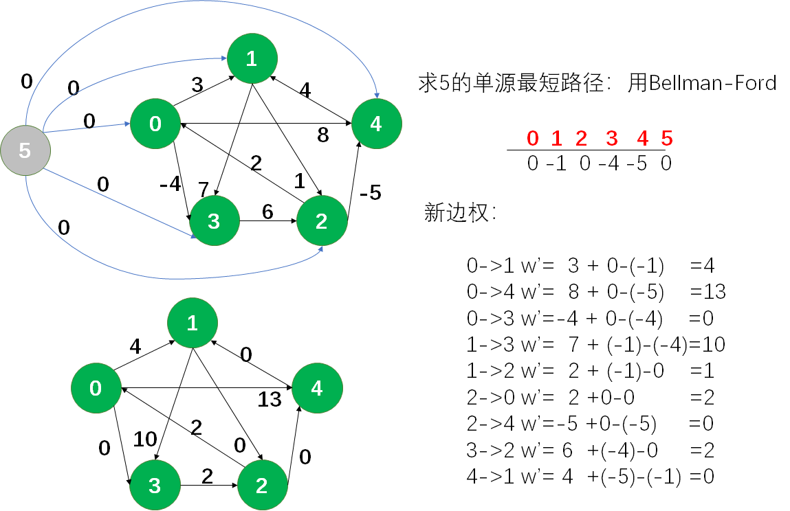


## 拎出来单独重点归纳提一下

DFS分为两种，假设DFS路径为a->b->c->d

- 先访问当前节点，再递归相邻节点，则访问顺序为a,b,c,d，输出顺序为a,b,c,d
- 先递归相邻节点，再访问当前节点，则访问顺序为a,b,c,d，输出顺序为d,c,b,a。这种在Tarjan等算法中很有用

## 参考资料

1. https://www.geeksforgeeks.org/graph-and-its-representations/
2. https://www.youtube.com/watch?v=0u78hx-66Xk&list=PLqM7alHXFySEaZgcg7uRYJFBnYMLti-nh&index=2
3. https://www.bilibili.com/video/av47042691?from=search&seid=9406491766784608254
4. https://www.hackerearth.com/zh/practice/algorithms/graphs/minimum-spanning-tree/tutorial/ MST
5. https://www.geeksforgeeks.org/kruskals-minimum-spanning-tree-algorithm-greedy-algo-2/ MST
6. https://www.geeksforgeeks.org/union-find/ 并查集
7. https://www.youtube.com/watch?v=4ZlRH0eK-qQ
8. https://www.youtube.com/watch?v=ZtZaR7EcI5Y&list=PLdo5W4Nhv31bK5n8-RIGhvYs8bJbgJFDR&index=5
9. https://blog.csdn.net/u014665013/article/details/51351371
10. https://www.youtube.com/watch?v=VJnUwsE4fWA 并查集
11. https://www.youtube.com/watch?v=wU6udHRIkcc并查集
12. https://www.geeksforgeeks.org/kruskals-minimum-spanning-tree-algorithm-greedy-algo-2/ Kruskal
13. http://www.codebelief.com/article/2017/04/prim-algorithm-introduction/ Prim
14. https://www.cnblogs.com/skywang12345/p/3711507.html Prim
15. https://www.geeksforgeeks.org/prims-minimum-spanning-tree-mst-greedy-algo-5/ Prim
16. https://www.cnblogs.com/bigsai/p/11489260.html Topological Sorting
17. https://www.youtube.com/watch?v=eL-KzMXSXXI Topological Sorting
18. https://en.wikipedia.org/wiki/Strongly_connected_component 强连通分量
19. https://www.youtube.com/watch?v=RpgcYiky7uw Kosaraju
20. https://www.bilibili.com/video/av83583621?from=search&seid=837966867845986532 Tarjan
21. https://www.geeksforgeeks.org/articulation-points-or-cut-vertices-in-a-graph/ 割点
22. https://www.bilibili.com/video/av84615547?p=2 Tarjan求割点和桥
23. https://www.bilibili.com/video/av64263196?p=34 点双连通、SPFA(p=13)
24. https://www.geeksforgeeks.org/dijkstras-shortest-path-algorithm-greedy-algo-7/ Dijkstra
25. https://www.youtube.com/watch?v=FtN3BYH2Zes Bellman-Ford
26. https://blog.csdn.net/HOWARLI/article/details/73824179 Johnson


